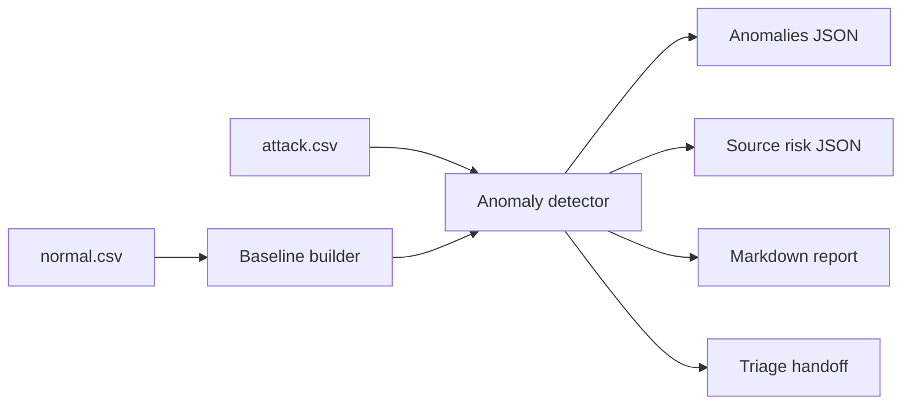

# Architecture

Network Baseline is a defensive lab for comparing normal traffic against observed traffic and flagging drift.

## Current MVP

- Parses timestamped network CSV logs.
- Builds a baseline of known sources, destinations, protocols, ports, and source volume.
- Detects new sources, new ports, new destinations, and volume spikes.
- Emits anomaly JSON, summary JSON, source risk JSON, report, and triage artifacts.

## Future Product Shape

- Rolling baseline windows with approval history.
- Suppression workflow for expected changes.
- Dashboard views for top sources, port drift, destination drift, and anomaly queue.
